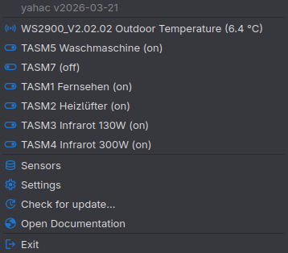

# yahac - Yet Another Home Assistant Client tool

  

  <b><a href="https://dseichter.github.io/yahac/">📖 Documentation (GitHub Pages)</a></b>

yahac - is a tool for Windows and Linux to show your most important entities of Home Assistant. See current values/states of your sensors or turn on/off your switches. And everything in the tray area.

You can configure as much as needed sensors and switches. As soon as you show the menu (right click on the yahac icon), the latest value of your entities will be collected and shown.

**!!! Because of false positive in Windows Defender ([see #34](https://github.com/dseichter/yahac/issues/34)) take a look into the [compatibility](https://dseichter.github.io/yahac/compatibility/) !!!**

## Home Assistant

Open source home automation that puts local control and privacy first. [https://www.home-assistant.io/](https://www.home-assistant.io/)

## Icons

yahac uses [Google Material Symbols](https://fonts.google.com/icons) within its code for UI icons.  
Material Symbols are licensed under the [Apache License 2.0](https://github.com/google/material-design-icons/blob/master/LICENSE) and are free for use in open source projects.
