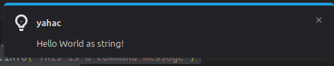

# Automation

Each yahac client can be integrated into the Home Assistants' Automation. 

If you have enabled MQTT, yahac automatically subscribes to the following topic:

* `yahac/<computername>/command`
* `yahac/<computername>/notify`

Replace the computername with your yahac client name (be aware, that only lower-case without special characters) and adjust your payload, see below.

## Example

This example automation will run test_mqtt_script.sh, located within the home directory, after the client is connected (startup of the yahac client).

```YAML
alias: yahac Test
description: ""
triggers:
  - type: connected
    device_id: 908faa2294da1c3e0c063a366d08de8f
    entity_id: e4635fbad32b512e3c84d9f0f12a53c6
    domain: binary_sensor
    trigger: device
conditions: []
actions:
  - action: mqtt.publish
    metadata: {}
    data:
      evaluate_payload: false
      qos: "2"
      retain: false
      topic: yahac/<computername>/command
      payload: "{\"command\": \"~/test_mqtt_script.sh\", \"data\": \"~Hello World\"}"
mode: single
```

You can provide any script you want to run on each yahac client. If your provided script should only run once, take care about *QOS*.

## Supported topics and payloads

Each topic has it's own individual parameters, you can use.

### command

You can provide individual payloads. But please take care, you provide at least the command itself.
The topic itself is defined with the schema `yahac/<computername>/command`.

**Possible payloads**

String:
```bash
~/test_mqtt_script.sh
~/test_mqtt_script.sh param1 param2 ...
```

JSON:
```JSON
{"command": "~/test_mqtt_script.sh", "data": "Hello World"}
{"command": "~/test_mqtt_script.sh", "data": {"parameter": "value", "another_parameter": "value", ...}}
```

!!! warning
    You run your commands on your own risk. Please be carefull! Only one command can be provided!

If your script or executable runs fine, you have to check by your own. In the logs (set to loglevel info), you will find the output of the execution itself, not the output the script.

### notify

You can sent some information directly to yahac, which will shown as notification.
The topic itself is defined with the schema `yahac/<computername>/notify`.




**Possible payloads**

String:

```bash
Hello World as string!
```

JSON:

```JSON
{"message": "Hello World"}
{"message": {"parameter": "value", "another_parameter": "value"}}
```

Providing an object instead of a string as value, it will be formated as JSON within the message.
This will enable you to receive immediately an information.
