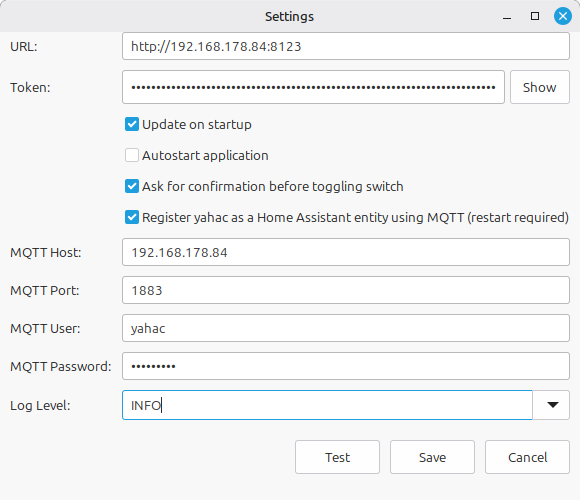

# Configuration

The configuration of yahac is really simple. Therefore most of the settings are already done, after you started the application the first time.

## Option

Important: after changing the host or token, you need to restart the application.

### URL

This is the url you reach your Home Assistant instance. Just copy and paste it from your browser.

### Token

The token, you have created can be added/shown here.

### Update on startup

Let yahac check during startup, of there is an update (never release on GitHub) available.

### Autostart application

If you wish, that yahac will start automatically after you have logged in to your computer, you can set this option to true.

### Ask for confirmation

This option is only relevant for switches. If you want to change the state of a switch, you should be sometimes careful. Therefore, default true, this option will enable a small confirmation dialog, as soon as you click on the entry.

.