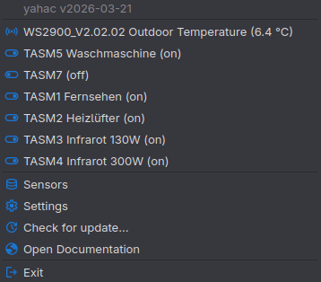

# yahac - Yet Another Home Assistant Client

yahac - Yet Another Home Assistant Client - is a tool to show your most important entities of Home Assistant.
See current values/states of your sensors or turn on/off your switches. And everything in the tray area. Run local commands or get notifications!



[](https://github.com/dseichter/yahac/releases)
[](https://github.com/dseichter/yahac/stargazers)

[](https://github.com/dseichter/yahac/issues)
[](https://github.com/dseichter/yahac/pulls)


## Features

* Add sensors and get their current data
* Show switches and turn them on/off with one click
* Integrate your computer as a binary sensor into Home Assistant (MQTT)
* Receive and process MQTT commands and notifications (JSON supported)
* Improved logging and diagnostics for troubleshooting
* Linux AppImage downloads are available in the release assets

You can configure as much as needed sensors and switches. As soon as you show the menu (left click on the yahac icon), the latest value of your entities will be collected and shown.

A full list of compatible and tested operating systems, can be found in the [compatibility](compatibility.md) overview.

Get all new features and fixes by downloading the latest [yahac release](https://github.com/dseichter/yahac/releases).


## Known issues

### Windows Defender 
There is a false positive alert after downloading the windows binary [#34](https://github.com/dseichter/yahac/issues/34). Exclude this file from your Windows Defender. I am working on it.

### GNOME
GNOME does not support Tray Menu out of the box. There are serveral solutions to enable a tray menu within GNOME. I can't recommend any of them at the moment.

### Window/Dialog Sizing

yahac uses PySide6 (Qt) for cross-platform GUI rendering. On some desktop environments, dialog and window sizes may not render at the exact specified dimensions due to platform-specific theme and font rendering differences. The application will automatically size windows to fit their content.

```
