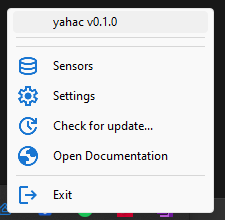

# Installation

YAHAC can be installed in multiple ways depending on your operating system and preferences.

## Download Options

### Standalone Binaries
Download pre-built binaries from the latest [release](https://github.com/dseichter/yahac/releases):

- **Windows**: `yahac-v*.exe` - No installation required
- **Linux**: `yahac-ubuntu-*` or `yahac-archlinux-*` - Portable executables

### Package Managers

#### Debian/Ubuntu/Linux Mint
```bash
# Download .deb package from releases
wget https://github.com/dseichter/yahac/releases/latest/download/yahac-debian-12-v*.deb
sudo dpkg -i yahac-debian-12-v*.deb
sudo apt-get install -f  # Fix dependencies if needed
```

#### Arch Linux/Manjaro
```bash
# Download .pkg.tar.zst package from releases
wget https://github.com/dseichter/yahac/releases/latest/download/yahac-arch-v*.pkg.tar.zst
sudo pacman -U yahac-arch-v*.pkg.tar.zst
```

#### Build from Source (Any Linux)
```bash
git clone https://github.com/dseichter/yahac.git
cd yahac
pip install -r src/requirements.txt
python src/yahac.py
```

## First time

!!! info
    You won't see any window appear, because yahac starts only as tray icon in your task bar :smile:.

If you start yahac the first time, it will create within your users directory a subfolder `.yahac` and also creates the configuration file `config.json`.

You will be asked to provide your URL and a token, which are needed to communication with your Home Assistant instance.


The token can be generated by opening your profile in Home Assistant, switch to security and scroll down to the long live access tokens.

More configuration is not needed to be able to proceed.

Now you can choose to proceed with adding your first [sensors](sensors.md) or make further [configuration](configuration.md).



!!! note "Package vs Binary"
    - **Packages (.deb/.pkg.tar.zst)**: Integrate with system, handle dependencies automatically, receive updates through package manager
    - **Binaries**: Portable, no system integration, manual updates required
    
    See [compatibility](compatibility.md) for distribution-specific information.
