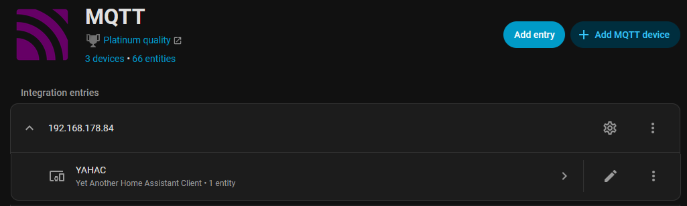
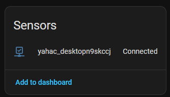

# MQTT

The integration of yahac with MQTT can be configured within the settings. 

You need to enable the [MQTT Integration inside Home Assistant](https://www.home-assistant.io/integrations/mqtt/).

As soon as you have enabled the MQTT integration, you can proceed with the MQTT setup of yahac.

!!! danger "Security Notice"
    MQTT integration allows remote command execution on your computer. Ensure your MQTT broker is properly secured with authentication and encryption. See [Automation Security](automation.md#command) for details.

## Configuration

Using the Settings entry of the yahac menu, you will see again the configuration window.

Provide all your relevant data and save. Don't forget to hit the checkbox to register yahac a entity into Home Assistant and restart yahac once.

## MQTT integration

During the startup, yahac will create (if not already done) a new MQTT integration. Within this integration, you will find all your yahac clients.

### yahac sensors

Each yahac instance you run on your computers will create automatically a new sensor. This sensor can now be used in automations, e.g. keep on a light or heating, etc.

The naming of each sensor has the prefix 'yahac_' and the computers' name without any special characters.
