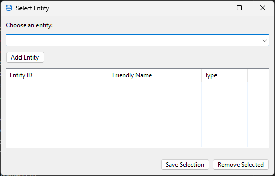
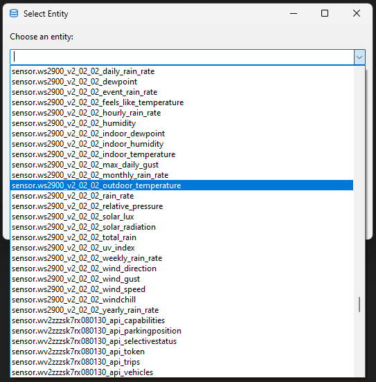
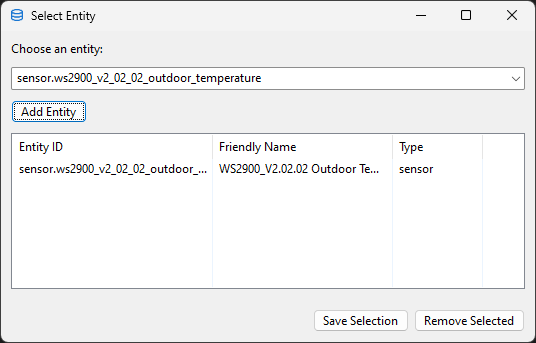
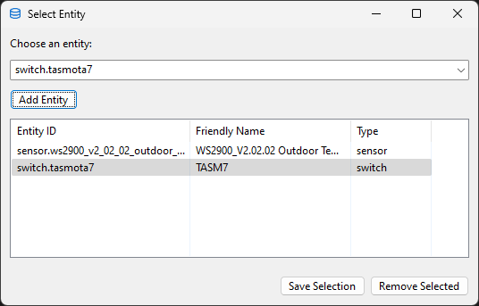
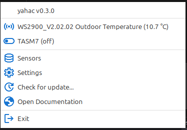

# Sensor

You can add a lot of sensors and switches to yahac. The number is not limited.

## Add entities

If you open the sensors window of yahac the first time, you will see an empty windows.

Open the combobox (drop down list) which will represent you all possible entities within your Home Assistant instance.
This list contains the entity_ids, which are unique.

After you have selected the entry from the combobox, it will automatically being added to the list of entities. You will also see the "Friendly name" (the one, you have configuration within HA) and the type. Per default, the type is `sensor`.

### Switches
If you want to add a switch, you have after your selection of the entity to change the type. Just click on the entry and a list of possible types will be present. Choose `switch`

### Save your entities
Now, it's time to save your choosen entities. There is **no autosave**, so please do not forget.

After you have choosen your sensors, they will appear immediately in the menu of yahac.

